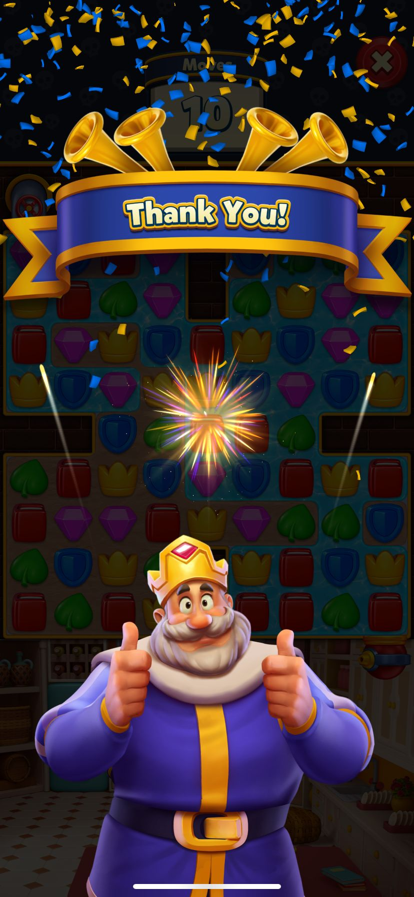
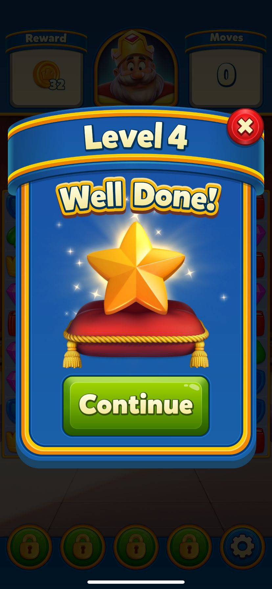
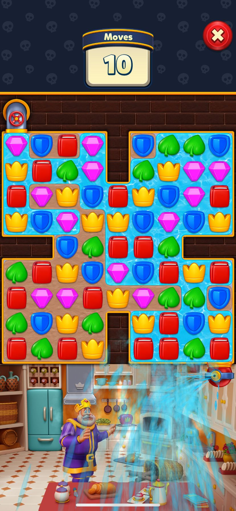

# Royal Match Product Analysis

## Overview

This project is a simple product analysis of the mobile puzzle game Royal Match.

The analysis mainly focuses on the first 15 levels of the game experience.

The goal is to understand how the game keeps players engaged with onboarding, rewards, progression systems, visual effects, and user experience design.

---

# 1. First Impression

At first, Royal Match looks like a simple casual puzzle game.

However, after a few levels, the game becomes more engaging with rewards, animations, and progression systems.

The game quickly gives players goals and creates a smooth experience for beginners.

---

# 2. Onboarding Experience

The first levels are easy and well guided.

The game teaches mechanics step-by-step without confusing the player.

## Key Observations

- Tutorial is simple and clear
- Early levels are easy to complete
- Players get rewards frequently
- The game avoids frustration in early levels

## Product Perspective

The onboarding system helps players feel successful quickly.

This improves first-time user experience and reduces the chance of players leaving the game early.

---

# 3. Progression & Retention Systems

Players collect stars after completing levels.

These stars are used to unlock decorations, objects, and castle areas.

This gives players long-term goals besides finishing puzzle levels.

## Key Retention Mechanics

- Star collection system
- Castle decoration system
- Short gameplay sessions
- Continuous rewards
- Fast progression feeling

## Product Perspective

The decoration system increases emotional connection to the game.

Players want to continue playing not only to pass levels, but also to improve the castle.

The game also creates a “one more level” feeling.

---

# 4. Reward Systems & Visual Feedback

Royal Match uses strong visual effects and animations.

Rockets, explosions, and combo effects make the gameplay feel satisfying.

## Key Observations

- Rocket effects are visually satisfying
- Combo animations feel rewarding
- Reward screens appear often
- Sounds and effects increase excitement

## Product Perspective

Visual feedback systems increase player satisfaction and motivation.

These effects encourage players to continue playing.

---

# 5. Level Design & Difficulty

The first 15 levels are mostly easy.

However, move limits make players think carefully and choose better moves.

## Key Observations

- Levels are beginner-friendly
- Difficulty increases slowly
- Move limits create strategy feeling
- Levels are short and fast

## Product Perspective

Even simple levels make players feel involved in puzzle solving.

This balance helps casual players enjoy the game without too much frustration.

---

# 6. Monetization Strategy

The game does not aggressively push purchases during the first levels.

Monetization systems appear slowly after the player becomes engaged.

## Key Observations

- Few interruptions during onboarding
- Monetization is introduced gradually

## Product Perspective

The game focuses on engagement and habit creation before encouraging purchases.

This strategy can improve long-term retention.

---

# 7. UX/UI Analysis

The interface is colorful, simple, and easy to understand.

Buttons are large and readable.

Animations and transitions feel smooth.

## Key Observations

- Clean interface
- Easy navigation
- Strong visual feedback
- Smooth animations

## Product Perspective

The UX design supports casual players and creates a comfortable gameplay experience.

---

# Conclusion

Royal Match successfully keeps players engaged with easy onboarding, rewarding visual effects, progression systems, and satisfying gameplay loops.

Even within the first 15 levels, the game creates strong player motivation and a smooth casual gaming experience.
